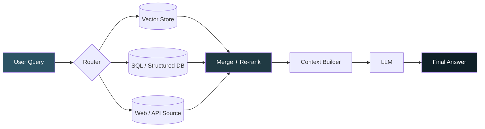

<div align="center">


<a href="#">
  
</a>

<br/>

[](https://www.python.org/)
[](https://docs.langchain.com/oss/python/langchain/rag)
[](LICENSE)
[](CONTRIBUTING.md)
[](../../stargazers)

</div>

---

## 📌 Overview

A lightweight, **multi-source Retrieval-Augmented Generation (RAG)** system designed to pull context from several heterogeneous sources at once — documents, databases, and web content — and hand it off to an LLM for grounded, accurate answers.

The core goal: **cut retrieval latency without sacrificing answer accuracy or consistency.** Instead of a single slow sequential lookup, sources are queried, scored, and merged through a pipeline built for speed.

> 📖 Reference implementation pattern: [LangChain RAG Docs](https://docs.langchain.com/oss/python/langchain/rag)

---

## ✨ Key Features

| | |
|---|---|
| ⚡ **Low-latency retrieval** | Parallelized multi-source querying instead of sequential fan-out |
| 🎯 **Accuracy-first ranking** | Re-ranking + deduplication before context is passed to the LLM |
| 🧩 **Pluggable sources** | Swap in new retrievers (vector DB, SQL, API, web) with minimal glue code |
| 🔁 **Consistent outputs** | Deterministic merging strategy keeps repeated queries stable |
| 📊 **Benchmark-ready** | Built-in hooks to measure retrieval time vs. answer quality trade-offs |

---

## 🏗️ Architecture

<div align="center">

</div>

<details>
<summary>📈 View as Mermaid diagram (renders natively on GitHub)</summary>



</details>

---

## 🧰 Tech Stack

- **Orchestration:** [LangChain](https://docs.langchain.com/oss/python/langchain/rag)
- **LLM:** *(add your model — e.g. GPT-4o, Genai)*
- **Vector Store:** *(add yours — e.g. Chroma)*
- **Language:** Python 3.10+

---

## 🚀 Quick Start

```bash
# Clone the repo
git clone https://github.com/your-username/multi-source-rag.git
cd multi-source-rag

# Set up environment
python -m venv myvenv

# Install dependencies
pip install -r requirements.txt

#Build vector database using
ingestion_pipline.py
```

### Usage

```python
from rag_pipeline import MultiSourceRAG

rag = MultiSourceRAG(sources=["vector_store", "sql_db", "web"])

response = rag.query("What changed in our Q3 pricing policy?")
print(response.answer)
print(response.sources)   # which sources contributed
print(response.latency)   # retrieval time in ms
```

---


---

## 🗺️ Roadmap

- [ ] Add caching layer for repeated queries
- [ ] Support streaming responses
- [ ] Add evaluation harness (accuracy vs. latency dashboard)
- [ ] Docker deployment guide

---

## 🤝 Contributing

Hello everyone I am Gitanshu .
Contributions, issues, and feature requests are welcome!
Feel free to check the [issues page](../../issues) or open a PR.

---

## 📄 License

Distributed under the MIT License. See `LICENSE` for details.

<div align="center">

</div>
